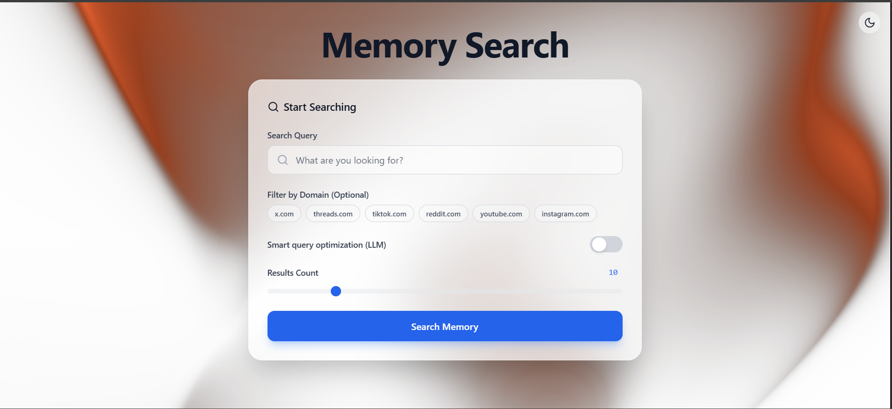

# Memory Search Engine  
### AI-Powered Retrieval-Augmented Search Platform

Memory Search Engine is a modern AI-powered search platform that combines multi-provider web search with advanced LLM reasoning. Built on Retrieval-Augmented Generation (RAG) principles, the system delivers synthesized, citation-backed answers alongside traditional search results through a responsive, interactive frontend.

---

## Table of Contents

- Overview  
- Core Capabilities  
- System Architecture  
- Tech Stack  
- Installation  
- Environment Configuration  
- Running the Application  
- Project Structure  
- Design Highlights  
- Contributing  
- License  

---

## Overview

Traditional search engines return links. Memory Search Engine goes further by:

- Aggregating results from multiple providers  
- Ranking results using hybrid semantic scoring  
- Generating AI-synthesized answers  
- Providing transparent source citations  
- Delivering a polished, interactive user experience  

The system integrates Google Gemini for reasoning and leverages vector search to enhance contextual retrieval.

---

## Core Capabilities

### AI-Generated Answers
- Synthesized summaries using Google Gemini  
- Context-aware reasoning over retrieved documents  
- Source-grounded responses  

### Multi-Provider Search Orchestration
- Exa.ai integration  
- SerpAPI integration  
- Extensible architecture for additional providers  

### Smart Query Optimization
- Optional LLM-based query refinement  
- Improved semantic relevance  

### Domain-Based Filtering
- Restrict results to specific platforms (Reddit, Twitter, YouTube, etc.)  

### Hybrid Ranking
- Combines semantic similarity (embeddings)  
- Keyword-based scoring  
- Relevance-weighted ranking  

### Interactive Frontend
- Plasma WebGL animated background (OGL)  
- Dark and Light theme support  
- Real-time loading states and transitions  
- Clean, responsive UI built with Tailwind CSS  

---

## System Architecture


Frontend (React + TypeScript)
↓
FastAPI Backend
↓
Search Orchestrator
↓ ↓
Exa API SerpAPI
↓
Vector Store (FAISS)
↓
LLM Reasoner (Google Gemini)
↓
Citation-Backed Response


The backend aggregates results, applies semantic ranking, stores contextual memory in a vector database, and generates final responses using an LLM reasoning layer.

---

## Tech Stack

### Backend
- FastAPI (Python)
- Google Gemini (`google-generativeai`)
- Exa.ai API
- SerpAPI
- Sentence Transformers
- FAISS (Vector Search)
- Redis (Caching)
- Pydantic
- NumPy
- python-dotenv

### Frontend
- React (Vite)
- TypeScript
- Tailwind CSS
- Lucide React
- OGL (WebGL-based Plasma Effect)

---

## Installation

### Prerequisites

- Python 3.8+
- Node.js 16+
- Docker & Docker Compose (recommended)
- API Keys:
  - Google Gemini
  - Exa API
  - SerpAPI (optional)

---

## Environment Configuration

Create a `.env` file inside the `backend` directory:

```env
GEMINI_API_KEY=your_gemini_key_here
EXA_API_KEY=your_exa_key_here
SERPAPI_KEY=your_serpapi_key_here
Running the Application
Option A: Docker (Recommended)

Ensure Docker is running.

docker-compose up --build

Backend runs at:

http://127.0.0.1:8000
Option B: Manual Backend Setup
cd backend
python -m venv venv

Activate environment:

Windows

venv\Scripts\activate

macOS/Linux

source venv/bin/activate

Install dependencies:

pip install -r requirements.txt

Ensure Redis is running locally, then start the server:

uvicorn app:app --reload
Frontend Setup

In a new terminal:

cd frontend
npm install
npm run dev

Frontend runs at:

http://localhost:5173
Project Structure
memory-search-engine/
├── backend/
│   ├── app.py
│   ├── orchestrator.py
│   ├── reasoner.py
│   ├── search.py
│   ├── llm.py
│   ├── models.py
│   ├── vector_memory/
│   └── requirements.txt
│
├── frontend/
│   ├── src/
│   │   ├── components/
│   │   ├── App.tsx
│   │   └── main.tsx
│   ├── package.json
│   └── tailwind.config.js
│
└── docker-compose.yml
Design Highlights

Retrieval-Augmented Generation (RAG) architecture

Hybrid semantic + keyword ranking

Modular search provider orchestration

Scalable vector memory design

Production-ready backend structure

Modern UI with real-time state handling

Contributing

Contributions are welcome.

Fork the repository

Create a feature branch

Commit changes

Push to your fork

Submit a Pull Request

License

This project is licensed under the MIT License.
